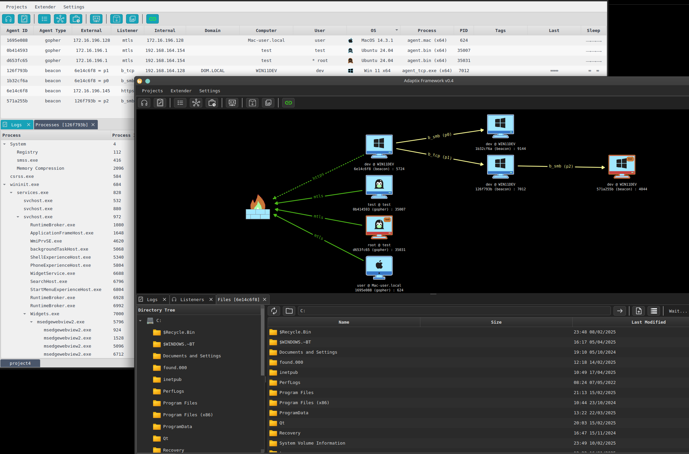

# AdaptixC2

## 1. Overview


<figure><figcaption><p>실행화면</p></figcaption></figure>

Adaptix는 모의 침투 테스터를 위해 만들어진 확장 가능한 사후 익스플로잇 및 적대적 에뮬레이션 프레임워크입니다. Adaptix 서버는 운영자가 유연하게 사용할 수 있도록 Golang으로 작성되었습니다. GUI 클라이언트는 C++ QT로 작성되어 Linux, Windows, MacOS 운영 체제에서 사용할 수 있습니다.


## 2. **Key Features Of AdaptixC2**

1. **멀티플레이어 지원을 위한 서버/클라이언트 아키텍처**: 이 기능을 사용하면 여러 사용자가 실시간으로 협업하여 팀 기반 모의 침투 테스트 시나리오를 개선할 수 있습니다.
2. **크로스 플랫폼 GUI 클라이언트**: 여러 운영 체제와 호환되는 클라이언트로 다양한 환경에서 다용도로 사용할 수 있습니다.
3. **완전 암호화된 통신:** 서버와 클라이언트 간에 교환되는 모든 데이터를 안전하게 보호하여 테스트 중 민감한 정보를 보호합니다.
4. **플러그인(extenders)으로서의 리스너 및 에이전트**: 익스텐더를 사용하면 HTTP/S 비콘 리스너 및 SMB 비콘 리스너와 같은 새로운 기능을 쉽게 통합할 수 있어 프레임워크의 확장성이 향상됩니다.
5. **클라이언트 확장성**: 사용자는 클라이언트에 새로운 도구를 추가하여 기능을 더욱 확장할 수 있습니다.
6. **작업 및 작업 저장소**: 테스트 중 작업과 작업을 관리하고 추적할 수 있는 체계적인 방법을 제공합니다.
7. **파일 및 프로세스 브라우저**: 대상 시스템에서 파일 시스템 및 실행 중인 프로세스에 대한 자세한 인사이트를 제공합니다.
8. **Socks4/Socks5/Socks5 인증 지원**: 네트워크 트래픽 조작을 위한 유연한 프록시 옵션을 지원합니다.
9. **로컬 및 역방향 포트 포워딩 지원**: 고급 네트워크 트래픽 라우팅 시나리오를 지원합니다.
10. **BOF 지원**: 버퍼 오버플로 익스플로잇 테스트가 가능합니다.
11. **에이전트 및 세션 연결 그래프**: 에이전트와 세션 간의 연결을 시각화하여 더 나은 감독을 지원합니다.
12. **에이전트 상태 검사기**: 에이전트의 상태를 모니터링하여 에이전트가 계속 작동하는지 확인합니다.


## 3. Installation

### 1. download sourcecode

AdaptixС2의 소스 코드는 [github](https://github.com/Adaptix-Framework/AdaptixC2/tree/main)에서 확인할 수 있습니다. main 브랜치는 stable 버전이며 최신 변경 사항이 포함되어 있지 않습니다.

```bash
git clone https://github.com/Adaptix-Framework/AdaptixC2.git
cd AdaptixC2
```


### 2. Pre install

AdaptixC2 오픈소스 프로젝트로 소스코드를 다운받아 직접 빌드하여 사용해야 하기 때문에 실행하기 위해서는 Golang및 관련  패키지들이 설치되어 있어야 합니다.

```bash
#패키지 설치
sudo apt install golang-1.24 mingw-w64 make
#심볼릭 링크생성
sudo ln -s /usr/lib/go-1.24/bin/go /usr/local/bin/go
```


AdaptixC2 폴더내에 `pre_install_linux.sh`  스크립트를 통해 간편하게 설치가 가능합니다.

다만 해당 스크립트를 실행하기전  패키지 설치 명령어와 심볼릭링크 생성 명령어에서 golang-1.23 버전을 golang-1.24 버전으로 수정 후 진행하시는걸 권장드립니다.



### 3. Server build

```bash
# ~/AdaptixC2
make server
make extender
```

<figure><figcaption><p> 서버 빌드</p></figcaption></figure>

### 4. Client build

```bash
make client
```

<figure><figcaption><p>클라이언트 빌드 </p></figcaption></figure>


## 4. Start

빌드가 정상적으로 성공했으면 서버와 클라이언트의 실행파일은 AdaptixC2 폴더내의 dist 폴더에 저장됩니다.

실행을 위해서 먼저 dist 폴더로 이동해 줍니다.

```bash
cd dist
```

### Start Server

AdaptixC2 서버를 실행하려면 SSL 인증서가 필요합니다.&#x20;

```bash
openssl req -x509 -nodes -newkey rsa:2048 -keyout server.rsa.key -out server.rsa.crt -days 3650
```


dist 폴더내의 ssl\_gen.sh 스크립트를 통해 빠르게 설치할 수 있습니다.


```bash
#server 실
./adaptixserver -profile profile.json
```

<figure><figcaption><p>server 실행</p></figcaption></figure>


