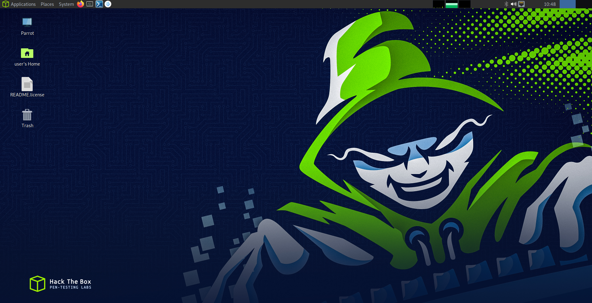
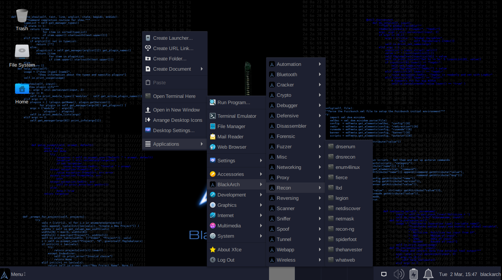
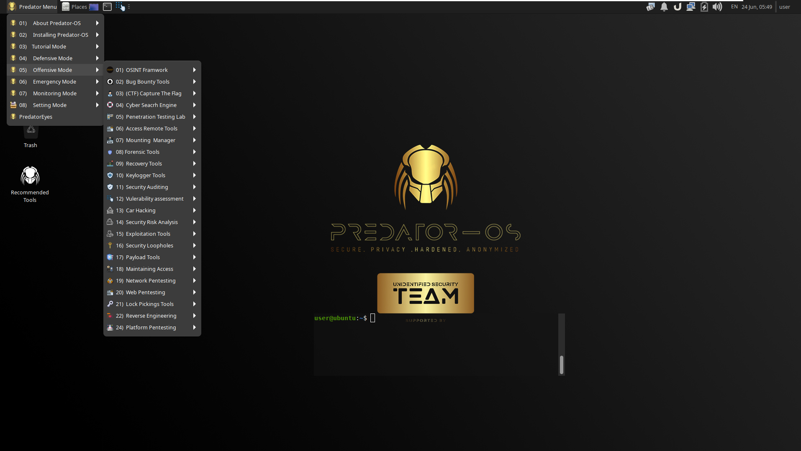

# Pentesting OS

## Linux 기반 OS

### 1. Kali Linux & Kali Purple

<figure><figcaption></figcaption></figure>



### 2. Parrot Security  

<figure><figcaption></figcaption></figure>



### 3. BlackArch Linux &#x20;

<figure><figcaption></figcaption></figure>



### 4. Predator OS

<figure><figcaption></figcaption></figure>



### 5. BlackUbuntu OS

### 6. BackBox OS 

### 7. Samurai Web Testing Framework &#x20;

### 8. Pentoo Linux&#x20;

### 9. CAINE&#x20;

### 10. ArchStrike&#x20;

### 11. Athena OS

## Windows 기반 OS

### 1. Commando&#x20;

### 2. Flare

